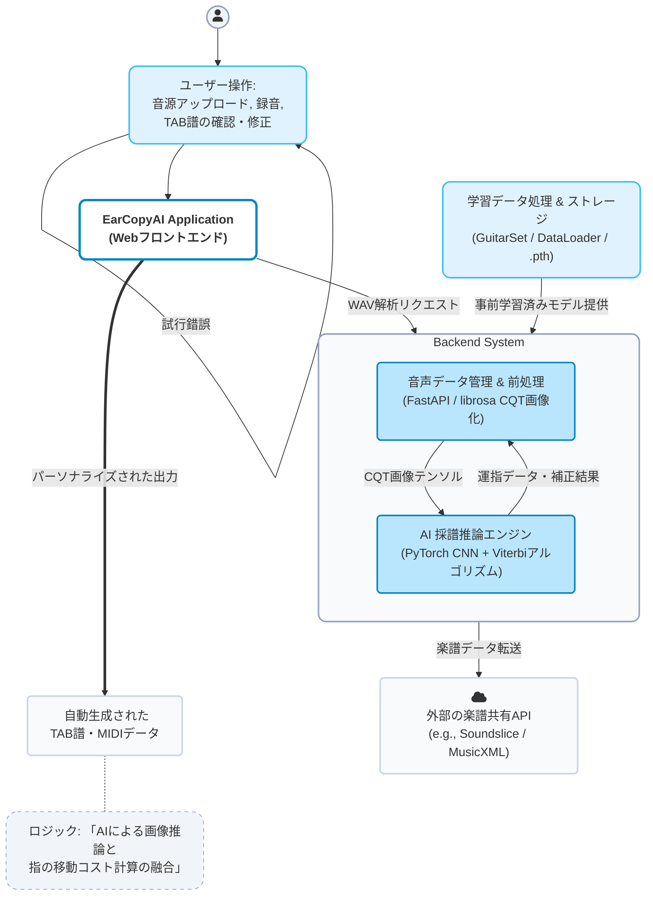

# EarCopyAI (V2) 

> 音響信号から直接、人間の物理的制約（運指）を考慮した高精度なギターTAB譜を全自動生成するエンドツーエンドAIシステム

## 概要 (Overview)
EarCopyAIは、既存の自動採譜ツールにおける「音高（ドレミ）は拾えても、ギター特有の複数ポジション（弦・フレット）への最適な落とし込みができない」という課題を解決するために開発されたWebアプリケーションです。

単なる「MIDI変換」ではなく、**「音色（倍音成分）に基づく弦推論AI（CNN）」**と**「動的計画法による運指コスト最適化（Viterbi）」**を融合させることで、理論上最も人間が弾きやすい、実用的なTAB譜を一意に導き出します。

# 🎸 EarCopyAI V2 システムアーキテクチャ

EarCopyAI V2における「学習パイプライン」と「Webアプリケーション推論パイプライン」を統合した、全体アーキテクチャ図です。ユーザーの操作から、バックエンドのAI処理、そして外部連携に至るまでの流れを可視化しています。

## システム構成図

## コア機能 (Core Features)
- **Deep Learning Acoustic Parsing**: `librosa`のCQT（定Q変換）とCNNを用いた高精度な音響解析。10ms単位で120クラス（6弦×20フレット）の活性確率を出力。
- **Biomechanical Hybrid Decoder**: AIの推論確率と、人間の手の開き幅・異弦同音の移動コストを掛け合わせた独自アルゴリズムによる運指最適化。
- **Modern Interactive UI**: Next.jsとAlphaTabを用いた、ブラウザ上でサクサク動く動的TAB譜レンダリングとプレビュー再生。

## アーキテクチャと技術スタック (Tech Stack)

### AI & Machine Learning
- **PyTorch**: 音響モデル（CNN/CRNN）の構築・学習
- **librosa**: 音響信号処理、CQTスペクトログラム変換
- **NumPy / Pandas**: データパイプラインと配列制御

### Backend & API
- **FastAPI**: 非同期推論サーバー（フロントエンドと疎結合化）
- **Python 3.x**: コアロジック実行

### Frontend & UI
- **Next.js (React)**: 高速なUIレンダリング
- **TypeScript**: 型安全なフロントエンド開発
- **AlphaTab**: MusicXMLデータの美しいTAB譜描画・自動再生

## アルゴリズムの仕組み (How it Works)
本システムの中核は、以下の最適化方程式によって「AIの耳」と「ギタリストの物理的制約」を統合することにあります。

`Total Cost = α * 物理的移動コスト(DP) - β * log(AIの推論確率)`

AIが「この音色は3弦である」と予測した場合でも、直前の運指からの移動距離（フレットの横移動・弦の縦移動）が人間にとって不可能であれば、アルゴリズムが自動的にコストを計算し、次に最適なポジションへ補正します。

## 開発ロードマップ (Roadmap)
- [ ] **Phase 1**: `GuitarSet`を用いたデータセット構築とCQT変換パイプラインの作成
- [ ] **Phase 2**: PyTorchによるCNN音響モデルの構築と学習（6弦×20フレットの確率推論）
- [ ] **Phase 3**: 動的計画法（ビタビアルゴリズム）を用いたハイブリッド運指デコーダの実装
- [ ] **Phase 4**: FastAPIによる推論APIサーバーの構築
- [ ] **Phase 5**: Next.js + AlphaTabによるモダンフロントエンドの実装

「私は現在、ギターの音源から自動でTAB譜を生成するAIシステム『EarCopyAI』のバージョン2を、ローカル環境でフルスクラッチ開発しています。

単に既存のAIツールを利用するのではなく、PythonとPyTorchを用いて、ディープラーニングのモデル（CNN）の設計から行いました。具体的には、音声波形をCQTという技術で画像データに変換し、それをAIに学習させるデータパイプラインを構築しました。

また、AI特有の『物理的にあり得ない運指（指の瞬間移動など）』を出力してしまう課題に対しては、動的計画法（ビタビアルゴリズム）を用いて、指の移動コストを数学的に計算し、人間が弾ける現実的なTAB譜に強制補正するアルゴリズムを自作して実装しました。

音を「画像」にする（AIの目）
ギターの音波を、AIが理解しやすいようにサーモグラフィーのような画像（CQT）に変換します。

画像を「運指」に変換する（AIの脳）
画像を見て「あ、これは3弦の5フレットだな」とAIが推測します。（今回PyTorchで作った部分です）

「弾きやすいTAB譜」に整える（補正）
AIのミスで「指が届かないような物理的にムリな動き」が出力されたら、人間が自然に弾ける運指に自動で修正します。